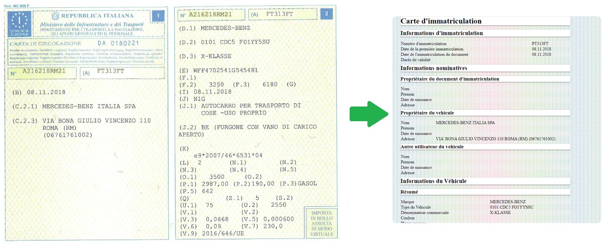

# Traitement-d-image
Programme permettant d'extraire des informations d'une carte grise italienne, afin de récuperer les champs variables,
en utilisant des méthodes de reconnaissance de caractères, un document XML est ensuite généré contenant les informations extraites.
Ce document permet de génerer un HTML permettant d'afficher les données sous une forme facile à lire et uniformisée.

  

